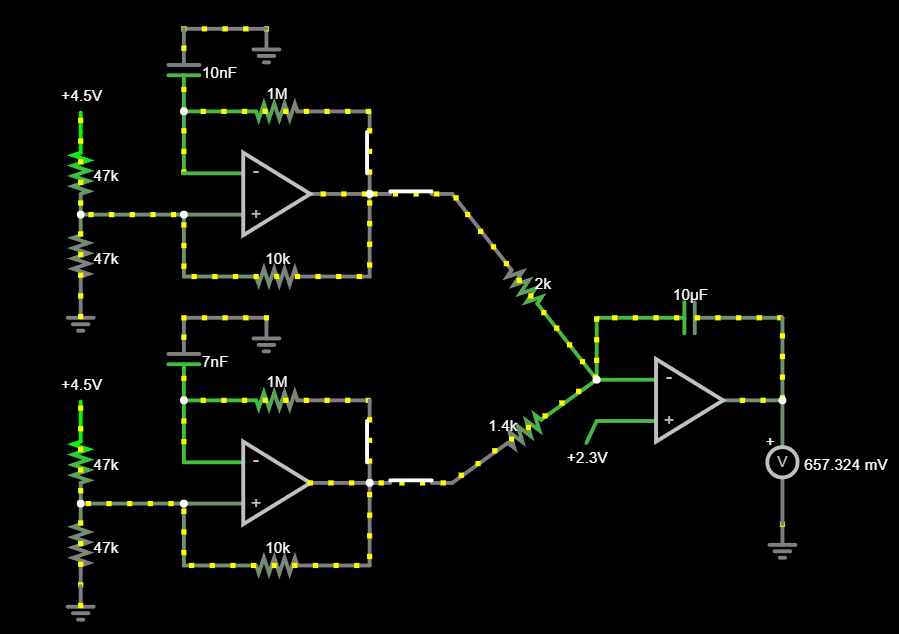
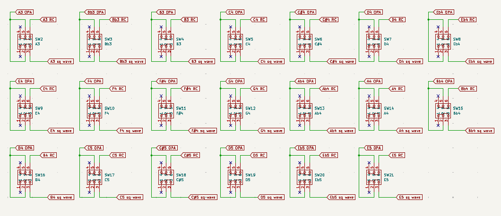
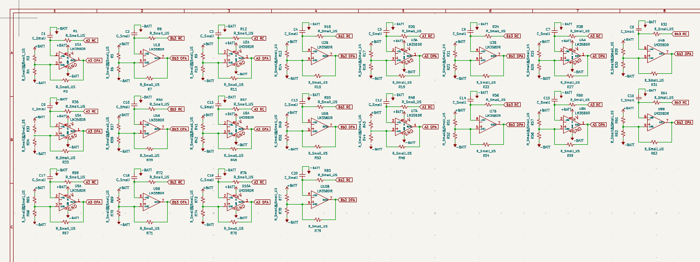

# April 25: button wiring and started square wave generators - 1hr

[Lapse link](https://lapse.hackclub.com/timelapse/XMe9OOed_9DX)

A lot of work designing wise and calculation wise was done before the event
and therefore I wasnt logging it, so thats how I just had a falstad sim and a
spreadsheet that will come in handy when calculating resistor and capacitor values
for the square wave generators for each key.

So far I'm thinking of having 20 keys for 20 notes on the synth, each with an op amp square
wave generator. The signals there will be passed into a summing integrator to generate
triangular waves and also so chords can be played and there will be one audio signal that can
be sent to a single speaker.

I initially thought I should pull the signal to half the battery voltage whenever a key isn't pressed,
and thats why I initially created a virtual ground with an op amp in the power circuitry. However, 
after thinking about it and testing in falstad, I realized that the summing integrator only works
if current is flowing into the capacitor, and if the button is disconnected, then no current should
flow from any non-pressed button into the summing integrator. Thats why I removed the pull down/up
resistor and the virtual ground.

After I started working on the square wave generators based on the simulation in falstad. I created 20
copies for 20 keys, and put in placeholder capacitors and resistors for now even though I will have
to change the values and probably even use combos of components in series and parallel to get the
oscillator to oscillate at a very precise frequency.

