## current total: 18 hr 25 min

# 1. April 25: button wiring and started square wave generators - 58 min

[Lapse link](https://lapse.hackclub.com/timelapse/XMe9OOed_9DX)

A lot of work designing wise and calculation wise was done before the event
and therefore I wasnt logging it, so thats how I just had a falstad sim and a
spreadsheet that will come in handy when calculating resistor and capacitor values
for the square wave generators for each key.

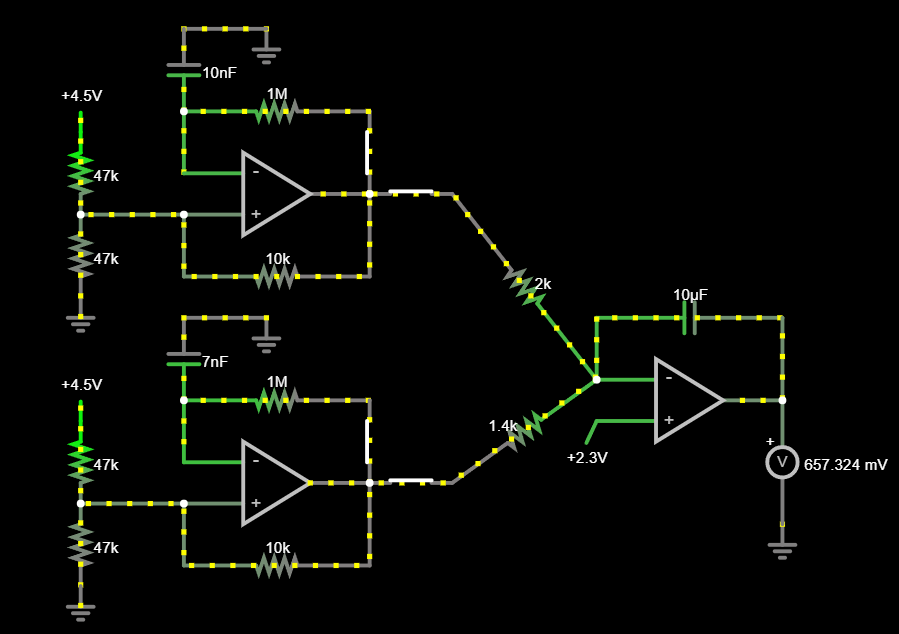

So far I'm thinking of having 20 keys for 20 notes on the synth, each with an op amp square
wave generator. The signals there will be passed into a summing integrator to generate
triangular waves and also so chords can be played and there will be one audio signal that can
be sent to a single speaker.

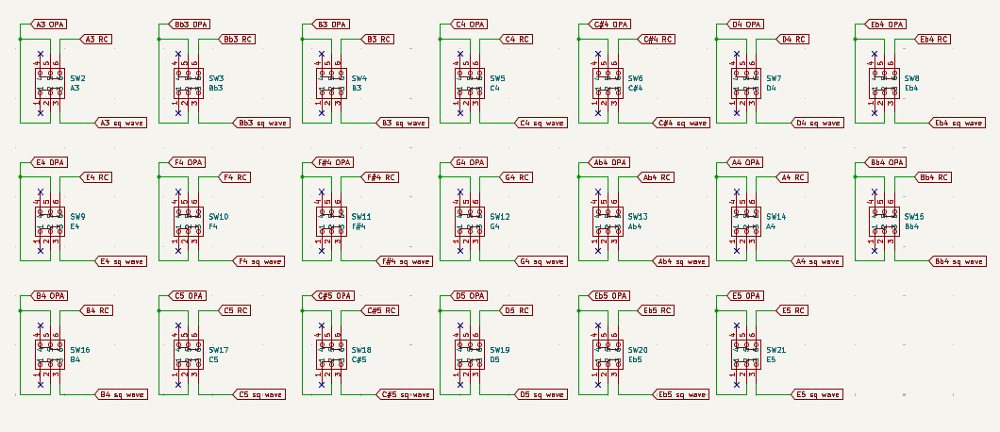

I initially thought I should pull the signal to half the battery voltage whenever a key isn't pressed,
and thats why I initially created a virtual ground with an op amp in the power circuitry. However, 
after thinking about it and testing in falstad, I realized that the summing integrator only works
if current is flowing into the capacitor, and if the button is disconnected, then no current should
flow from any non-pressed button into the summing integrator. Thats why I removed the pull down/up
resistor and the virtual ground.

After I started working on the square wave generators based on the simulation in falstad. I created 20
copies for 20 keys, and put in placeholder capacitors and resistors for now even though I will have
to change the values and probably even use combos of components in series and parallel to get the
oscillator to oscillate at a very precise frequency.

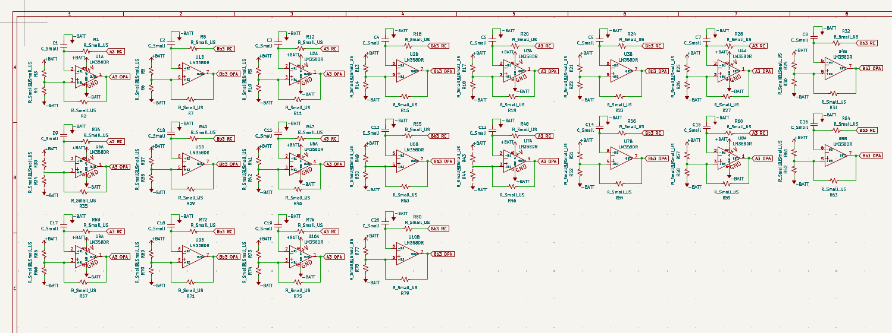

# 2. April 26: calculating resistor and cap values - 1 hr 50 min

[Lapse 1 link](https://lapse.hackclub.com/timelapse/UGRWi7fOgnEr) 
[Lapse 2 link](https://lapse.hackclub.com/timelapse/yOD0rQpwBWg-) 
(my computer died midway so i had to create 2 lapses)

So to generate the square wave, there is basically and rc circuit that charges
and discharges between certain thresholds and thats how you get the oscillitory behavior.
The voltage thresholds and time constant of the rc circuit determine the oscillation frequency,
so I made a calculator in google sheets to calculate the ideal resistance of the resistor in
the rc circuit, given the resistance of the resistors that set the threshholds and the
capacitor in the rc circuit.

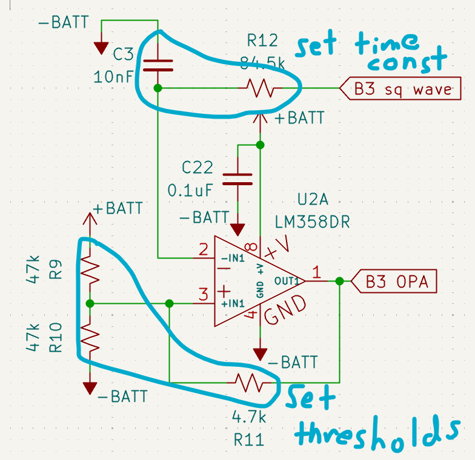

My reasoning behind calculating the resistance of the resistor the rc circuit in terms of the other
values specifically was accuracy and cost constraints. Each successive semi tone has frequency ~6%
more than that of the previous one, so tolerances have to be kept tight. Capacitors were the limiting
factor here, as most of the capacitors with 1% tolerance were in the picofarad range. Counteracting a
capacitance that high would require resistors in the high kiloohm or megaohm range, and at that point
I feared that the input bias current and internal resistance of an op amps inputs would become non negligible.
The highest capacitance capacitor with 1% tolerance I found was a 10nF capacitor, and I just ended up
using that for all the circuits, with resistors between 100k to 60k.

Since the resistors that set the threshholds are being used in the highest quantity, I decided to use
standard values for those to minimize cost and use them to broadly set thresholds while using the rc circuit
resistor for fine control. I sometimes had to use a combination of 2 resistors for the rc circuit resistor,
which I calculated from the kicad calculator.

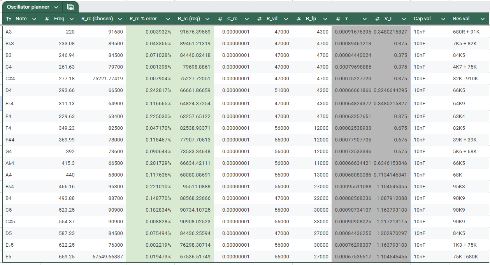

# 3. April 26: transfered resistor and cap vals from sheet to schematic - 43 min 

[Lapse link](https://lapse.hackclub.com/timelapse/Qg3-tjRS4mQi)

Basically just took all the values from the calculations sheet and transfered them to the schematic.

Other than that I added bypass caps to all the op amps which I forgot to add before.

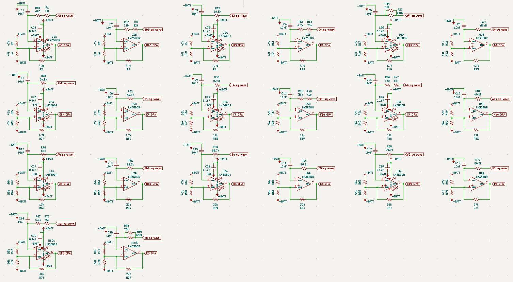

# 4. April 27: calculating integrator input resistor values and testing - 47 min

[Lapse 1 link](https://lapse.hackclub.com/timelapse/QXdK0oR-2zmq) 
[Lapse 2 link](https://lapse.hackclub.com/timelapse/3a47_ErUy7ww) 
(I was working on this during school hours and had to stop midway)

Since I wanted to use triangular waves, the square wave signals have to be integrated using an op amp
integrator. However, triangular waves of the same amplitude and different frequency have varying slopes
and therefore their derivatives have different amplitudes. The square wave generators produce waves of the
same amplitude but different frequency, their weightage when integrating has to be adjusted. For the input
resistors, higher frequency waves have use lower resistances and vice versa. I quickly created a calculator
in google sheets that would take in a sigle value for the input resistor of E5 (the highest note on the synth)
and would generate corresponding resistance values for the rest of the notes.

Accuracy here wasn't as important as with the square wave generators themselves so I pretty much just tried
to use the single closest resistance resistor I could find on LCSC and not create any combos.

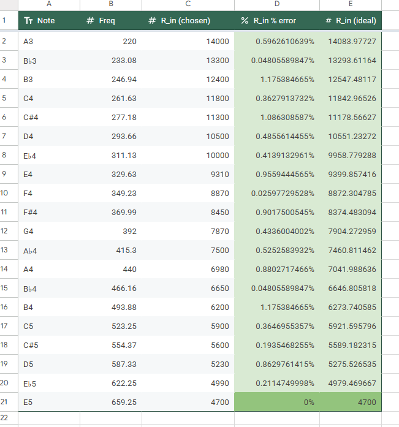

After that I started researching and simulating what capacitance feedback capacitor I would need to create
triangle waves that oscillate between 0 and 4.5 V given square waves between 0 and 4.5V. I also tried 
experimenting with what resistance feedback resistor I should put in parallel with the capacitor, because
any small dc offset in the input signal could be integrated indefinetly without the feedback resistor.

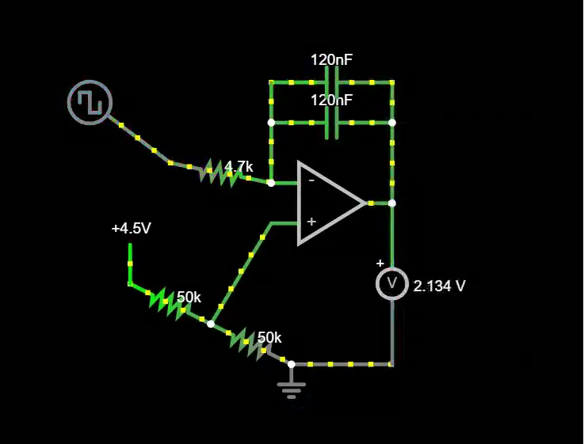

# 5. April 27: figuring out summing integrator details and finish schematic - 2 hr 10 min

[Lapse link](https://lapse.hackclub.com/timelapse/Z7mOHeCurYkQ)

After thinking a bit I realized that if chords were gonna be playing on the synth, then the actual sum
of the triangular waves can exceed the power supply range of 0-4.5V, and so that the op amp would essentially
truncate the signal and the feedback capacitor would saturate. The feedback resistor in parallel would help
alleviate the issue but not exactly solve it in a sustainable manner because it would discharge slowly.
I briefly tried to find a solution that would add up signals the way I wanted to instead of using the op
amp integrator, but ultimately I decided that I could increase the capacitance of the feedback capacitor by
a certain factor, which would essentially divide the trianglular wave signals by said factor. Then the gain
on the audio amplifier itself would be set to that factor. This would allow more than 1 signal to be added
and the output of the integrator would stay within the range of 0-4.5V.

There would also be a volume control potentiometer between the integrator and audio amplifier, so in
case that chords are being played and the audio amplifier tries to amplify the signal beyond the range of the power
supply, the volume can always be turned down and the signal doesnt get capped by the audio amplifier.

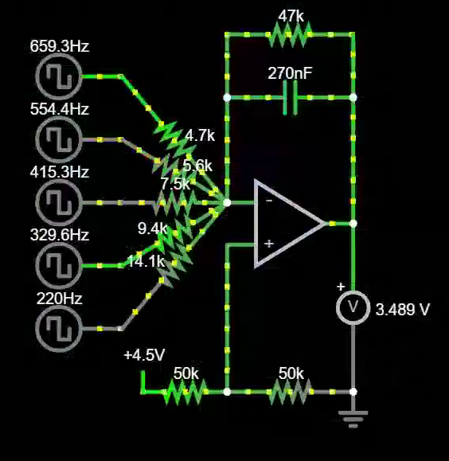

Then I created the schematic for the summing integrator, and spent a bit of time trying to find
a logarithmic potentiometer that could work better for volume control (LCSC didn't have any filter for the
resistance taper of a pot so I had to some googling and pouring through datasheets).

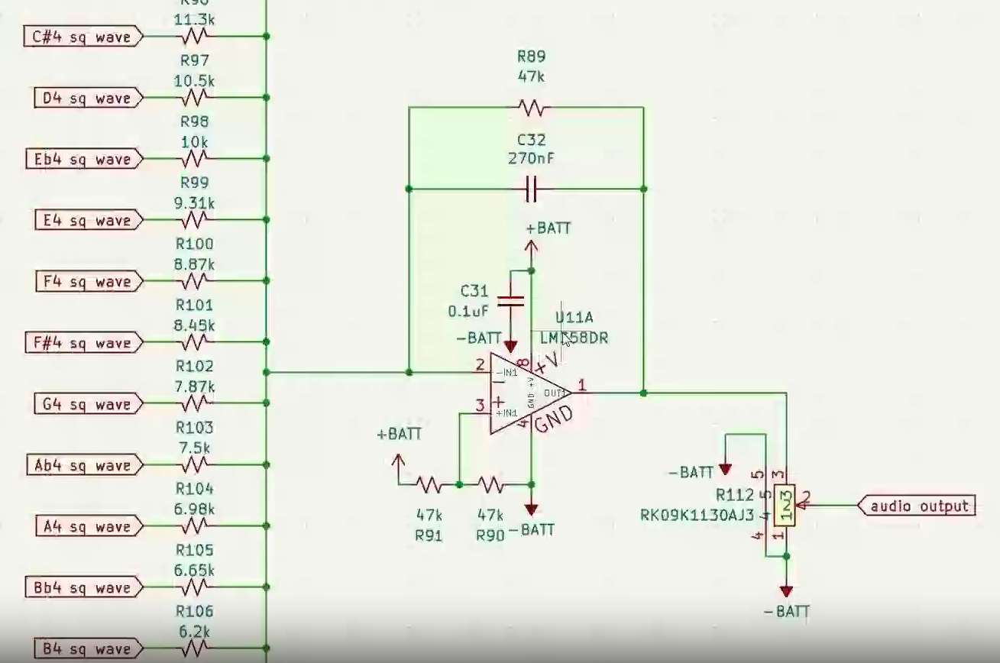

Also then I created the schematic for the audio amplifier itself but that was relatively easy compared to the rest
of the stuff because I pretty much just had to copy what was on the datasheet.

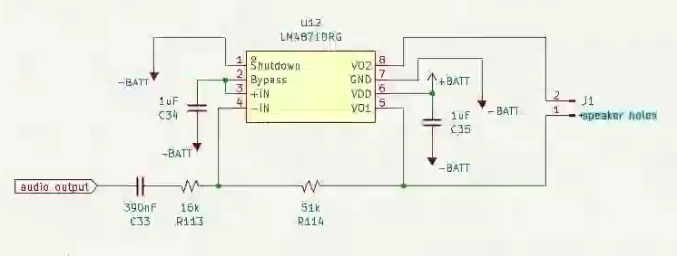

Oh and finally I just tried to find the specific components I would be using for the speaker, battery pack, and
power switch. I spent a bit of time trying to look for a speaker on LCSC but the only usable speakers couldn't be
used with JLC's PCBA because they had wire leads or were mounted on a weird way I decided to look on amazon and
found something that I could just hand solder. I also found the battery holder on amazon and found some random rocker
switch on LCSC.

# 6. April 27: assigning footprints to resistors/capacitors - 1 hr 37 min

[Lapse link](https://lapse.hackclub.com/timelapse/cLXiM7vzMPkf)

So yeah I pretty much just scrolled on lcsc to find the cheapest capacitor/resistor of the desired value and
set the footprint in kicad as well as store the lcsc ID in a separate sheet so I can find it later when putting
in the PCBA order. It took really long because I had over 50 resistors/capacitors to find footprints for.

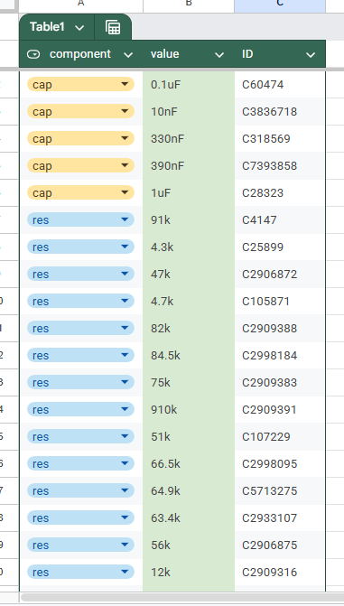

# 7. April 28: routing sq wave generators - 1 hr 48 min

[Lapse link](https://lapse.hackclub.com/timelapse/d9Doj7t-r9ec)

I mainly focused on routing the square wave generators and buttons. I decided that the buttons should all be in
one line, so that when the keys rotate around the same pivot all of them will get pressed the same angle. I
thought 9mm was also good for the spacing between them so it keeps the board relatively small whilst giving enough
width for fingers to press the buttons once the keys are made in the proper formation. (I decided I would figure out
the shape and spacing of the keys later in the cad and thought this was good enough for now)

As for how I routed it, each op amp IC is used by 2 notes, so I decided to route everything section by section,
arranging the resistors/capacitors in a compact layout beside the IC and then placing the whole section over 2 buttons.

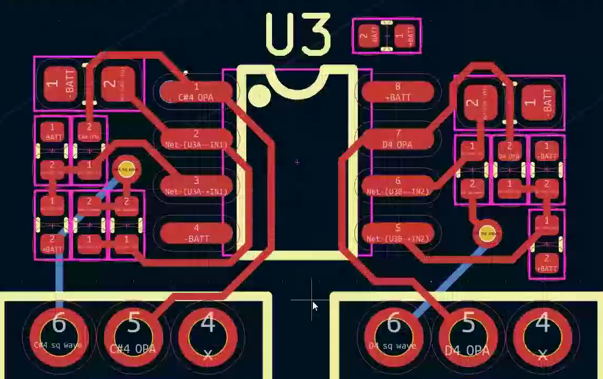

# 8. April 28: routed the rest of the components - 1 hr 53 min

[Lapse link](https://lapse.hackclub.com/timelapse/QsBIlKXCmpY3)

Basically I routed the op amp integrator, the audio amplifier circuitry, and the power nets.

I added some annotations on the User.drawings layer for the speaker to make sure it would fit in the corner as well as to
demarcate a line which was the absolute closest I could put the large components like the switch, battery pack, and speaker
to the switches. This was done with quick calculations based on how far the switches can depress and the desired angle I
want the keys to get pushed.

Because all of the square wave generator units were kind of in one line I thought the easiest way to connect them to the op
amp integrator is just to have a really big horizontal trace that connects them all. I decided to do the same thing on the
other side for connecting components to the positive power supply. However, since I had like 2 big horizontal traces, when
I filled in the ground planes on both sides it kind of just created a bunch of islands unconnected to the negative terminal
of the battery. I spaced those 2 long horizontal traces apart from eachother so I could add stitching vias between them and
connect the filled regions.

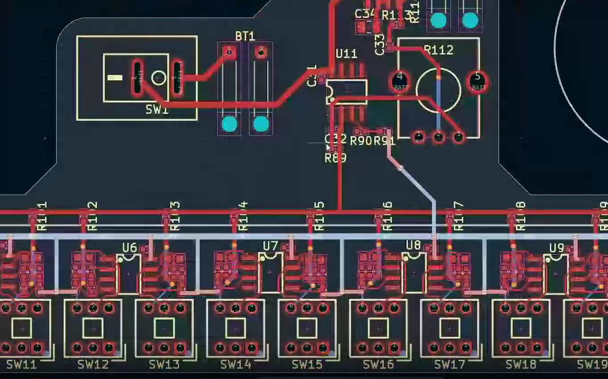

When connecting the negative power supply terminal of the op amps to the ground plane I also had
to do some sketchy via stiching so everything is connected. After that I kind of just added stiching vias everywere else and 
ran the DRC and corrected any errors like with the trace clearance, board outline, and silkscreen layers.

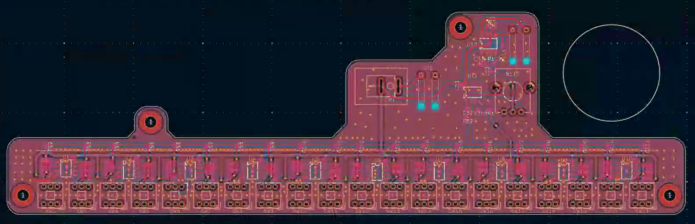

# 9. April 29: reorganizing pcb - 51 min

[Lapse 1 link](https://lapse.hackclub.com/timelapse/Ao8oIryRy3H3) 
[Lapse 2 link](https://lapse.hackclub.com/timelapse/HrQK-3vRCD9V)

So I came back the next day and I realized that I made my pcb unnecessarily tall and could squish things vertically to save
cost. Prevously the audio amplifier circuitry was above the op amp summing integrator so I just put them side by side. To do
that I just deleted the stitching vias up there because I thought they would clutter eveything up, and then I reorganized and
added them back.

My main concern was whether 3 AA batteries could fit next to the board within the rectangular outline of the board, but I
realized that if I'm alr not putting the batteries on the board itself and putting them in the case so that it doesnt matter anyway.
I just created a rectangle with the rough measurements of 3 AA batteries and put it on there for reference to make sure I had
enough horizontal space without any conflictions, as I did with the speaker previously.

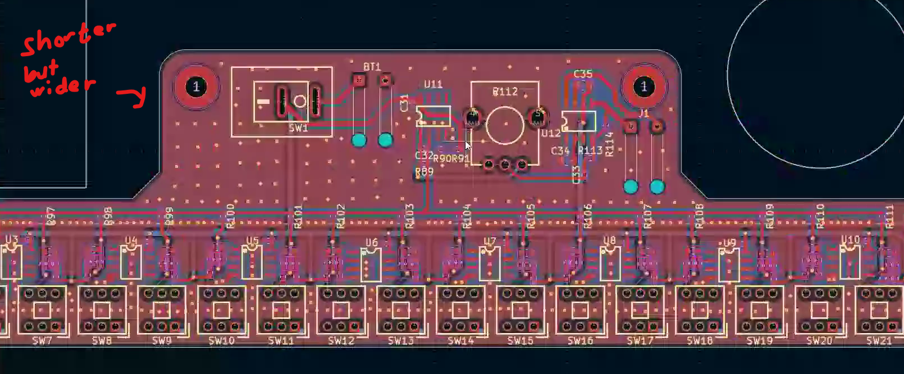

I also briefly decided to edit the courtyard of the potentiometer footprint because in the DRC it was giving me some error
about a self intersecting outline. Otherwise I fixed any other issues I saw in the DRC.

# 10. May 3: redoing resistor calculations (bc i basically have to redo majority of the pcb) - 1 hr 14 min

[Lapse link](https://lapse.hackclub.com/timelapse/J1vTO9Q7Ml87)

so basically
i have learned something that requires me to redo the bulk of the pcb

Apparently jlcpcb has parts that are extended components or basic (or promotional extended). The main difference being that
for the extended parts they charge extra for having to replace the feeder on their pick and place machines for each unique
component, and the cost of each unique component is like $3. And since I had like over 50 resistors and capacitors (and pretty
much all of the ones I had selected were extended components), I would have to pay an insane amount of money.

So now I had to shop on jlcpcb.com/parts instead of lcsc and filter for basic or promotional extended components.

I decided to worry abt the capacitors later because I pretty much used mostly standard values and figured those would be easier.

For the resistors, however, I standardized all the resistors that set the thresholds for the rc circuits to 47k and 4.7k to reduce
costs. For the ones on the actual rc circuit I just used kicad's resistor calculator to generate a combo of 2 standard E24 resistors
because that pretty much always got me a percent error of within ±0.1% of the ideal value.

I also used the same resistor calculator method for the input resistors of the op amp integrator.

In this worksession I just figured out the values on the google sheets calculator/planner I used before.

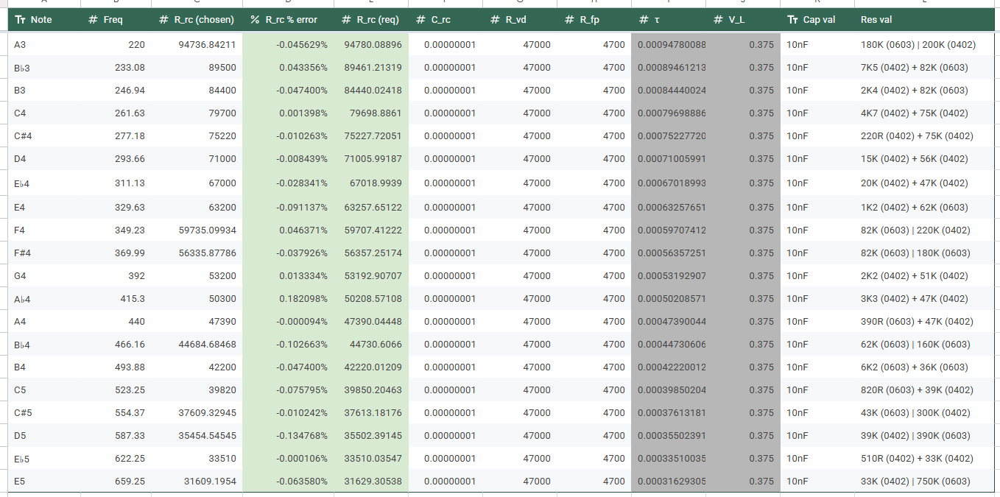

# 11. May 3: transferring new resistor values to the schematic - 37 min 

[Lapse link](https://lapse.hackclub.com/timelapse/3dXqgCB-hV9-)

Yeah so I just took the values I calculated in the previous worksession and I put them in the schematic ig

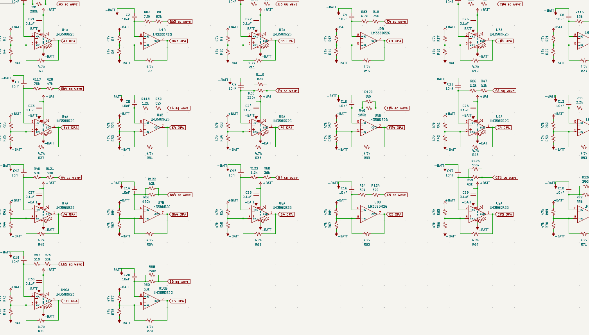

# 12. May 3: rerouted majority of pcb from new changes - 2 hr 32 min

[Lapse link](https://lapse.hackclub.com/timelapse/cHo6mlO-20iH)

so basically im gonna have a fun time because now I have to use 0603 with 0402 resistors when trying to fit everything compactly
and when I had already found a really compact way to use 0402 resistors only.

First I just double checked that I had correctly transfered the resistor values from the sheet to kicad, then I decided to actually
find basic/promotional extended lib capacitors on jlcpcb.com, then I went about changing the footprints for everything.

After that I pulled one of the op amp units to the side and tried to route everything off of a cluttered board to try to find the
best way to connect everything in a compact manner. I pretty much settled on a way that was good enough, and then I put it back on
board and began to route everything else. I did try to look back at the first few ones I did to try to route everything the same
way, but because of there were so many combinations of 0603 and 0402 resistors in series and parallel, I gave up trying to keep everything
consistent at some point and just started doing whatever. I got to route the square wave generators for 17 notes.

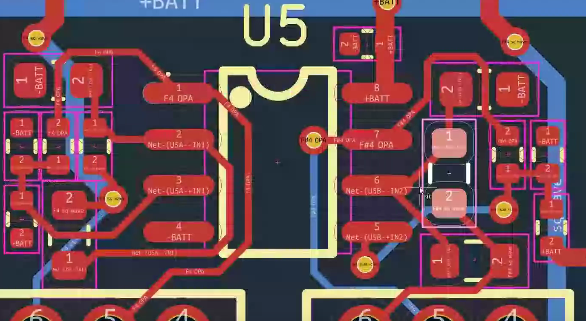

# 13. May 3: finished routing square wave generators and integrator input resistors - 48 min

[Lapse link](https://lapse.hackclub.com/timelapse/7DHDekHChPlv)

I just finished routing the 3 square wave generators left as well as the op amp integrator input resistors. For those I also didn't try
to route them in a consistent fashion I kinda did whatever based on if the resistors were in series or parallel.

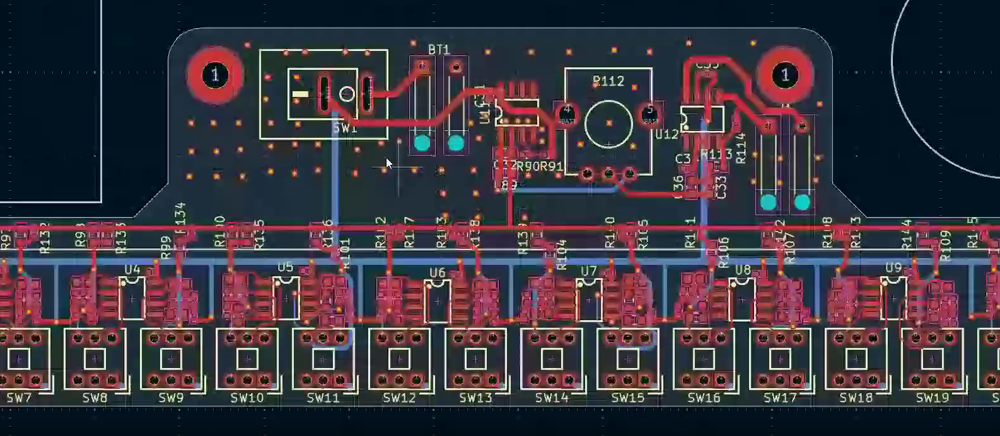

# 14. May 4: wired power nets again basically - 37 min

[Lapse link](https://lapse.hackclub.com/timelapse/A2BREO0AHGPJ)

After all the component and routing changes I readded all the stitching vias to connect all the ground planes, as well as connect the op
amp negative power supply pins to the bottom ground plane bc they were kinda isolated. After that I just did some minor checks and
revisons based on the DRC.

The PCB should be done actually now

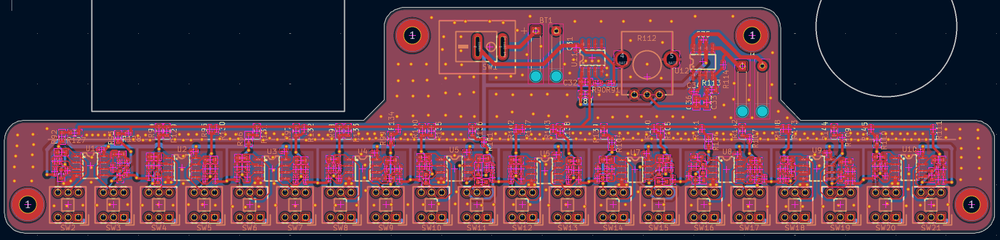

